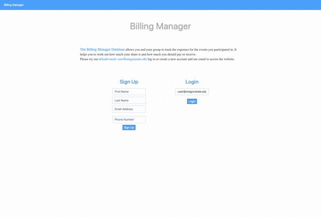

# Billing Manager


## Description
**A tracking shared expenses social network**
* Designed and implemented a full-stack web application for each event with particular purpose for splitting bills (HTML,
CSS, JavaScript and Node.js/Express).
* Used relational database MySQL to store users, events and billing data.

## MySQL database

### Data Definition

```sql
CREATE TABLE `User` (
  `User_ID` int(10) AUTO_INCREMENT NOT NULL,
  `First_Name` varchar(20) NOT NULL,
  `Last_Name` varchar(20) NOT NULL,
  `Email` varchar(50) NOT NULL,
  `Phone` VARCHAR(15) DEFAULT NULL,
  `Balance` decimal(10,2) DEFAULT 0,
  PRIMARY KEY (`User_ID`),
  UNIQUE KEY `Email`(`Email`)
) ENGINE=InnoDB AUTO_INCREMENT= 1 DEFAULT CHARSET=latin1;

CREATE TABLE `Event` (
  `Event_ID` int(10) AUTO_INCREMENT NOT NULL,
  `Name` varchar(20) NOT NULL,
  `Category` varchar(20) NOT NULL,
  `Location` varchar(10) NOT NULL,
  `Participants` int(10) DEFAULT 1,
  `Total_Expense` decimal(10,2) DEFAULT 0,
  `Event_Share` decimal(10,2) DEFAULT 0,
  `Status_Open` tinyint(1) DEFAULT 1,
  PRIMARY KEY (`Event_ID`)
) ENGINE=InnoDB AUTO_INCREMENT=1 DEFAULT CHARSET=latin1;

CREATE TABLE `User_Event` (
  `User_ID` int(10) NOT NULL,
  `Event_ID` int(10) NOT NULL,
  PRIMARY KEY(`User_ID`,`Event_ID`),
  CONSTRAINT `User_Event_ibfk_1` FOREIGN KEY (`Event_ID`) REFERENCES Event(`Event_ID`) ON DELETE CASCADE,
  CONSTRAINT `User_Event_ibfk_2` FOREIGN KEY (`User_ID`) REFERENCES User(`User_ID`)
) ENGINE=InnoDB DEFAULT CHARSET=latin1;

CREATE TABLE `Item` (
  `Item_ID` int(10) AUTO_INCREMENT NOT NULL,
  `Description` varchar(15) NOT NULL,
  `Event_ID` int(10) NULL,
  `Payer_ID` int(10) NOT NULL,
  `Quantity` int(10) DEFAULT 0,
  `Invoice_Amount` decimal(10,2) DEFAULT 0,
  PRIMARY KEY (`Item_ID`),
  CONSTRAINT `Item_ibfk_1` FOREIGN KEY (`Event_ID`) REFERENCES Event(`Event_ID`) ON DELETE CASCADE,
  CONSTRAINT `Item_ibfk_2` FOREIGN KEY (`Payer_ID`) REFERENCES User(`User_ID`)
) ENGINE=InnoDB AUTO_INCREMENT=1 DEFAULT CHARSET=latin1;

CREATE TABLE `Statement` (
  `Statement_ID` int(10) AUTO_INCREMENT NOT NULL,
  `User_ID` int(10) NOT NULL,
  `Event_ID` int(10) NOT NULL,
  `Event_Paid` decimal(10,2) DEFAULT 0,
  `Event_Balance` decimal(10,2) DEFAULT 0,
  PRIMARY KEY(`Statement_ID`),
  CONSTRAINT `Statement_ibfk_1` FOREIGN KEY (`Event_ID`) REFERENCES Event(`Event_ID`) ON DELETE CASCADE,
  CONSTRAINT `Statement_ibfk_2` FOREIGN KEY (`User_ID`) REFERENCES User(`User_ID`)
) ENGINE=InnoDB AUTO_INCREMENT=1 DEFAULT CHARSET=latin1;
```
### Data Manipulation

```sql
-- Create a new user
INSERT INTO User(First_Name, Last_Name, Email, Phone) VALUES (:First_Name_Input, :Last_Name_Input, :Email_Input, :Phone_Input);

-- Create an event
INSERT INTO Event(Name, Category, Location) VALUES (:Name_Input, :Category_Input, :Location_Input);

-- Create user-event relation
INSERT INTO User_Event VALUES (:User_ID, :Event_ID);

-- Add a participate in current event
-- INSERT INTO SELECT Syntax(Reference: https://www.w3schools.com/sql/sql_insert_into_select.asp)
INSERT INTO User_Event SELECT User_ID, :Event_ID FROM User u WHERE u.Email= :Email_Input;

-- Add item into item table
INSERT INTO Item (`Description`, `Event_ID`, `Payer_ID`, `Quantity`, `Invoice_Amount`)
VALUES (:Description_Input, :Event_ID, :Payer_ID, :Quantity, :Invoice_Amount_Input);


-- Insert value into Statement table (This value will be presented after event is closed)

INSERT INTO Statement(User_ID, Event_ID, Event_Paid, Event_Balance)
SELECT ue.User_ID, ue.Event_ID, IFNULL(SUM(Invoice_Amount), 0), Event_Share - IFNULL(SUM(Invoice_Amount), 0)
FROM User_Event ue
LEFT JOIN Item i ON ue.User_ID = i.Payer_ID  AND ue.Event_ID = i.Event_ID
INNER JOIN Event e ON e.Event_ID = ue.Event_ID
WHERE ue.Event_ID = 1
GROUP BY ue.User_ID, ue.Event_ID;


-- Login query user_id and save it in browser
SELECT User_ID, First_Name, Last_Name FROM User u WHERE u.Email=:Email_Input;

-- return event ID
-- when we create the user and event relations, we needs Event_ID
-- reference: https://stackoverflow.com/questions/17112852/get-the-new-record-primary-key-id-from-mysql-insert-query
SELECT LAST_INSERT_ID();

-- Get all the events information (made a change)
SELECT Name, Category, Location, Participants, Total_Expense, Event_Share, Status_Open FROM Event e INNER JOIN User_Event ue ON ue.Event_ID =e.Event_ID WHERE ue.User_ID  = :User_ID;

-- Display current participates in event page
SELECT u.First_Name, u.Last_Name FROM User u
INNER JOIN User_Event ue ON ue.User_ID = u.User_ID
WHERE ue.Event_ID =:Event_ID;

-- Display all the items information of an event
SELECT Description, First_Name, Last_Name, Quantity, Invoice_Amount
FROM Item i INNER JOIN User u ON u.User_ID = i.Payer_ID  
WHERE i.Event_ID= :Event_ID;
```
